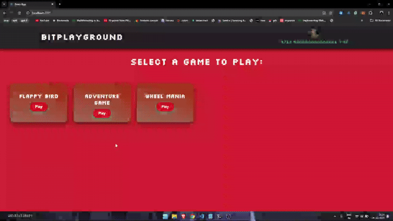

## About the Game

This is an **AI text-based Adventure game** where the story and choices are dynamically generated using a language model (LLM). Players navigate through multiple events, and their decisions shape the narrative and determine how far they progress.

Each game session includes:

* Real-time story generation using AI.
* Branching choices with good/bad outcomes.
* Score tracking based on event progression.

---

## Part of a Blockchain Gaming Platform

This game was originally developed as part of a **blockchain-integrated gaming platform**, where:

* New users receive a few free tokens.
* Players spend tokens to play.
* Winning multiplies their spent tokens; losing forfeits them.
* Wallet and token handling is done via blockchain smart contracts.

---

## 🧪 Test Mode (No Blockchain Required)

A `test` version is included so you can run the game **without setting up the blockchain**.

You can:

* Play the game locally.
* Experience the full AI-driven narrative.
* Skip wallet and token checks.

To run the test version:

* Use the `test` file for the frontend.
* Connect to the `llm-endpoint` for the backend.

---

## 🎥 Demo

  
